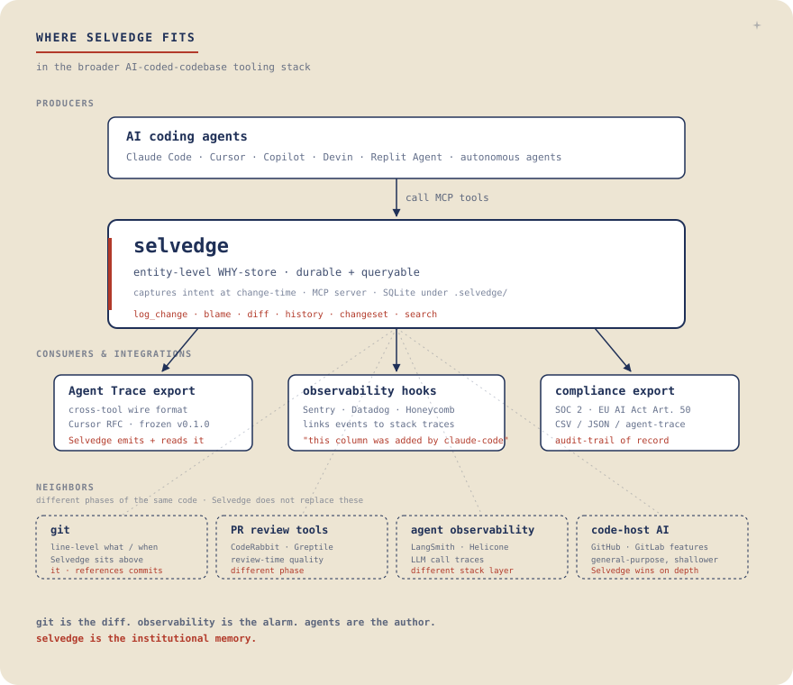

<p align="center">
  
</p>

<p align="center">
  <a href="https://selvedge.sh"><strong>selvedge.sh</strong></a>
  &nbsp;·&nbsp;
  <a href="https://pypi.org/project/selvedge/"><strong>PyPI</strong></a>
  &nbsp;·&nbsp;
  <a href="https://github.com/masondelan/selvedge"><strong>GitHub</strong></a>
</p>

<p align="center">
  <a href="https://github.com/masondelan/selvedge/actions/workflows/test.yml"></a>
  <a href="https://pypi.org/project/selvedge/"></a>
  <a href="LICENSE"></a>
</p>

<!-- mcp-name: io.github.masondelan/selvedge -->

**Long-term memory for AI-coded codebases — including what was already
tried and rejected.**

Line attribution tells you who wrote something. Selvedge tells your agent
what *not* to write next: the approaches this codebase already tried,
reverted, and why. It's a `git blame` for AI agents, for the *why* rather
than which model touched which line — captured live, by the agent, as the
change happens, so nothing downstream has to guess at it.

Selvedge is a local MCP server. AI coding agents (Claude Code, Cursor,
Copilot) call it as they work to log structured change events with
reasoning. Your data stays in a SQLite file under `.selvedge/` next to
your code.

**Local-first by default, team-server by choice, zero-LLM always.**

---

Six months ago, your AI agent added a column called `user_tier_v2`. You don't
know why. `git blame` points to a commit from `claude-code` with a generated
message that says "Update schema." The session that made the change is long
gone — and so is the prompt that produced it.

With Selvedge, you run this instead:

```bash
$ selvedge blame user_tier_v2

  user_tier_v2
  Changed     2025-10-14 09:31:02
  Agent       claude-code
  Commit      3e7a991
  Reasoning   User asked to add a grandfathering flag for legacy free-tier
              users during the pricing migration. Stores the original tier
              so we can backfill discounts without touching billing history.
```

That reasoning was **captured by the agent in the moment** — written into
Selvedge from the same context that produced the change. Not inferred from
the diff afterward by a second LLM. Not a hand-typed commit message.

---

<!-- DEMO GIF
     Record a 30–45 second terminal session showing:
     1. `selvedge status`  →  shows N total events
     2. `selvedge blame payments.amount`  →  full output with reasoning
     3. `selvedge diff users --since 30d`  →  table of recent changes
     4. `selvedge search "stripe"`  →  filtered results
     Use `vhs` (https://github.com/charmbracelet/vhs) or Asciinema.
     Replace this comment block with: 
-->

---

## Who Selvedge is for

Selvedge has two audiences. Same tool, same `pip install`, same SQLite
file under `.selvedge/`. Different scale of pain.

**Teams running long-term, AI-coded codebases.**
When the project is big enough that you (or someone else) will touch it
again in six months, twelve months, three years — but most of it was written
by an agent whose context evaporated the day each PR shipped. `git blame`
tells you what changed. Selvedge tells you *why* — even after the agent
session, the prompt template, the developer who asked for it, and the model
version are all long gone. This is the original use case: production
codebases, schema decisions, migrations, dependency changes that need an
audit trail that survives turnover.

**Solo developers using Claude Code on everyday projects.**
Side projects, weekend builds, the small internal tool you keep poking at.
You don't need enterprise governance — you just need to remember why you (or
your agent) did the thing you did yesterday, last week, last sprint. Run
`selvedge init` once. Add four lines to your `CLAUDE.md`. From then on,
`selvedge blame` is muscle memory — a way to talk to your past self when
your past self was an LLM.

If you've ever come back to your own AI-built project and thought "what was
this *for* again?", Selvedge is the missing piece.

---

## The problem

Human-written code leaks intent everywhere — commit messages, PR descriptions,
inline comments, the Slack thread that preceded it. AI-written code doesn't.
The agent has perfect clarity about why it made each decision, but that
context lives in the prompt and evaporates when the conversation ends.

Six months later, your team is debugging a schema decision with no trail.
`git blame` tells you *what* changed and *when*. It can't tell you *why*.

**Selvedge captures the why — live, by the agent itself, as the change is
made.** The diff is git's job. The why is Selvedge's.

---

## What's new in v0.3.10

**The memory comes to the agent, and the store gets its dials.** Two themes,
shipped together because the config half is what the rest needed to read
settings from.

**Delivery.** Selvedge already blocked re-edits of reverted entities. What was
missing was delivery when there is nothing to veto. Two new hooks:

- **SessionStart** injects a compact digest as a session begins — decisions due
  for a revisit, entities that were tried and reverted, recent changesets.
- **PreCompact** fires just before context compaction destroys this session's
  reasoning and names the watched entities you edited but never logged.

Both are quiet when they have nothing to say, size-capped, read-only, and
templated. Neither can block anything — PreCompact deliberately declines the
veto the hook API offers it. This is the answer to a measured failure mode: two
2026 papers recorded pull-model memory tools going unused entirely (zero
voluntary memory operations across 114 turns against a pre-seeded store) while
deterministic injection landed every time.

**`selvedge export --format markdown`** renders the store as a reviewable
digest to commit next to it, so captured intent shows up in a pull request
instead of hiding inside a binary. Deterministic — regenerating with no new
events is a zero-line diff.

**Config.** `.selvedge/config.toml` is now first-class, with a canonical
precedence chain that `selvedge doctor` prints per setting. It brings:

- **`selvedge prune --include-events`** — the first path that can delete
  captured reasoning, so it needs *both* a confirmation and
  `SELVEDGE_DESTRUCTIVE=1`. Neither alone is enough, because `--yes` in a cron
  entry defeats a prompt and a shell profile defeats an env var. Events
  retention defaults to never.
- **Event-size bounds** (`diff_bytes`, `reasoning_bytes`) that truncate loudly
  — a marker in the text, a warning at write time, a count in `selvedge stats`.
- **Secret-shape warnings** at `log_change`, extendable via
  `redaction_patterns`, plus a `doctor` row that scans what's already stored.
  Warn, never reject.

**Also:** five review issues closed. The enforcement hook's allow path is
**40% faster** (33.6 ms → 20.1 ms per gated call) and `SELVEDGE_HOOK_DISABLE=1`
finally short-circuits before the imports it was documented to skip;
`log_change` no longer discards `revisit_after` / `constraint` / `stale_when`
on renames and supersedes; the CLI's `--json` and the MCP tools now return
identical structures; and the Docker image no longer ships the maintainer's
own database. Tests 826 → 984.

---

## What's new in v0.3.9.3

**Fixes a broken install, and lands a full code-quality pass.** `mcp` 2.0.0
(released 2026-07-28) removed `mcp.server.fastmcp`, and Selvedge declared
`mcp>=1.0.0` with no upper bound — so any `pip install selvedge` after that date
pulled 2.0.0 and `selvedge-server` failed at import. This release pins the
dependency. **If your server stopped starting, this is why — upgrade.**

It ships alongside a review that put nine independent passes over the codebase
and then tried to *disprove* every finding before acting on it. Seventeen
confirmed defects fixed. The ones you would actually have noticed:

- **The enforcement hook stopped blocking things it shouldn't.** Reading a
  tracked file — `cat`, `git diff`, `pytest`, `ruff check` — was blocked, and
  the remediation the error message told you to run was blocked by the same
  gate, so there was no way out from the CLI. Two more paths fed the same
  false blocks: a commented-out line of SQL counted as a real deletion, and any
  commit message merely containing the word "revert" marked every file it
  touched as reverted.
- **Lookups got fast at scale.** The main entity read was scanning every row —
  measured 7.4 ms → 0.35 ms at 100k events, and the hook had been taking
  seconds on large stores.
- **`selvedge setup` can no longer delete parts of your `CLAUDE.md`**, an
  interrupted backup can no longer destroy your last good one, and upgrading
  while two Selvedge processes are running no longer crashes with an error that
  looked like database corruption.

Tests went 739 → 826. No schema change and no tool-surface change, so this is
**drop-in for anyone on 0.3.9.x**.

---

## Where Selvedge fits

<p align="center">
  
</p>

AI agents call Selvedge as they work. Selvedge captures the *why*
into a durable, queryable store and emits it back out — as
[Agent Trace](https://github.com/cursor/agent-trace) records for
cross-tool readers, as observability metadata that links into
Sentry/Datadog stack traces, and as compliance artifacts for SOC 2
and EU AI Act audits.

Selvedge does **not** replace `git` (line-level what/when), PR review
tools (review-time quality), agent observability (LLM call traces),
or general-purpose code-host AI features. It sits between them — the
provenance-as-first-class-citizen layer that everything else
references.

---

## How Selvedge compares

There's a fast-growing "git blame for AI agents" category. Here's where
Selvedge fits — and where it deliberately doesn't.

|  | Reasoning source | Granularity | Mechanism | Grouping | Storage |
|---|---|---|---|---|---|
|  | Rejected paths | Reasoning source | Granularity | Mechanism | Grouping | Storage |
|---|---|---|---|---|---|---|
| **Selvedge** | **Queryable** — `prior_attempts` returns tried → reverted → re-opened | **Captured live**, by the agent in the same context that produced the change | **Entity** — DB column, table, env var, dep, API route, function | **MCP server** — agent calls it as work happens | **Changesets** — named feature/task slugs across many entities | SQLite, zero deps |
| [OpenLore](https://github.com/clay-good/OpenLore) | Purged — `rejected` is an inactive status, dropped from the queryable store after each decision sync (the annotation survives in the synced spec markdown) | **Derived** — tree-sitter static analysis of code state, plus commit-gated decision notes | AST node (18 languages + 12 IaC) | MCP server — one-time index + commit-time certificates | Call-graph edges | SQLite graph in `.openlore/` |
| [AgentDiff (sunilmallya)](https://github.com/sunilmallya/agentdiff) | None | **Inferred post-hoc** by Claude Haiku from the diff at session end | Line | Git pre/post-commit hook | None | JSONL on disk |
| [AgentDiff (codeprakhar25)](https://github.com/codeprakhar25/agentdiff) | None | ed25519-signed cross-agent provenance | Line | Git hook | None | Local |
| [Origin](https://github.com/mattzcarey/origin) | None | Captured at commit time | Line | Git hook | None | Local |
| [Git AI](https://github.com/oleander/git-ai) | None | Attribution metadata | Line | **Agent-invoked checkpoint** → Git notes at commit | None | Git notes |
| [BlamePrompt](https://github.com/blameprompt/blameprompt) | None | Prompt-only | Line | Git hook | None | Local |

**Why "rejected paths" matter — the one that isn't copyable.** The expensive
failure isn't forgetting why a column exists. It's an agent confidently
re-implementing something the team already killed for a good reason, six
months after everyone who knew that left the context window. None of the
line-attribution tools above surface rejected paths at all, and it isn't a
feature gap they can close in a release — a line-oriented store has no notion
of an entity that persisted across a try → revert → retry cycle. See
[`docs/demos/prior-attempts.md`](docs/demos/prior-attempts.md).

**Why determinism matters.** Selvedge's reasoning is the agent's own intent,
written from the same context window that produced the change. There is no
model anywhere in the storage or retrieval path, so the same query returns the
same answer today and in two years, across model versions. Tools that infer
reasoning post-hoc are running a second LLM that never saw the original
prompt: what it produces is paraphrase, and re-running it can produce
different categories for the same change. As a Hacker News commenter put it
about a competing approach, *"grep won't find your commit because you rejected
'oauth-library'… unless there is deterministic enforcement"*
([0x457](https://news.ycombinator.com/item?id=47354263)).

Determinism alone is no longer a separator — OpenLore is deterministic-native
too, and says so. The compound that separates is **append-only testimony**:
reasoning the agent wrote itself, kept in a store where a rejection is a
first-class record rather than an inactive status to be swept up.

**Why "entity-level" matters.** Most tools attribute *lines*. Selvedge
attributes *things you actually search for*: `users.email`,
`env/STRIPE_SECRET_KEY`, `api/v1/checkout`, `deps/stripe`. The first
question after `git blame` is usually *"what's the history of this column"*,
not *"what's the history of lines 40–48 of users.py"*.

**Why "captured live" matters.** Not a differentiator on its own — every tool
here claims some flavour of it — but it's the *mechanism* that makes the
reasoning trustworthy. Writing at the moment of the change, from the context
that produced it, is the reason there's no second model in the path to
hallucinate an explanation. An empty `reasoning` field is itself an honest
signal: the agent didn't have one.

<sub>Comparison current as of 2026-08-06; OpenLore at v2.1.8 / 265★,
verified against its source. Corrections welcome as an issue.</sub>

**Why "changesets" matter.** A Stripe billing rollout touches the `users`
table, two new env vars, three new API routes, one dependency, and four
functions across the codebase. Tag every event with `changeset:add-stripe-billing`
and you can pull the entire scope back later — even if the original PR was
broken into eight smaller ones over a month.

**Selvedge ↔ Agent Trace.** [Agent Trace](https://github.com/cursor/agent-trace)
(Cursor + Cognition AI, RFC Jan 2026, backed by Cloudflare, Vercel, Google
Jules, Amp, OpenCode, and git-ai) is an emerging *open standard* for AI
code attribution traces. Selvedge isn't a competitor to it — it's a
compatible producer. As of **v0.3.9**, `selvedge export --format agent-trace`
emits Agent Trace v0.1.0 records (and `selvedge import --format agent-trace`
reads them back); the mapping is in
[`docs/agent-trace-interop.md`](docs/agent-trace-interop.md). Agent
Trace is the wire format. Selvedge is the live capture + query layer that
emits it.

---

## Quickstart

### Claude Code — install the plugin (recommended)

Two commands, inside Claude Code. No prior `pip install` — the plugin
bootstraps the server itself via `uvx` (or `pipx`):

```
/plugin marketplace add masondelan/selvedge
/plugin install selvedge@selvedge
```

That's the whole agent-facing surface in one step:

- the **MCP server** — 8 tools (`log_change`, `prior_attempts`, `blame`,
  `diff`, `history`, `changeset`, `search`, `stale_decisions`);
- a **skill** that tells the agent *when* to call them — before editing a
  tracked entity, after any substantive change;
- the **PreToolUse enforcement hook** — schema/migration edits are blocked
  until `prior_attempts` has been checked this session, with the prior
  reasoning in the block message;
- **slash commands** — `/selvedge:status`, `/selvedge:blame <entity>`,
  `/selvedge:history`, `/selvedge:prior-attempts <entity>`.

The store (`.selvedge/selvedge.db`) creates itself on the first logged change.
Two optional extras stay CLI-side: the post-commit hook that stamps each event
with its commit hash (`selvedge install-hook`), and — if you want the
`selvedge` command on your own shell `PATH` — `pip install selvedge`, which the
launcher then prefers over `uvx` for an exact pinned version.

> **Plugin or `selvedge setup` for Claude Code? Pick one.** Both wire the MCP
> server; running both registers it twice. The plugin is the lighter path and
> the one that updates itself. If you're on the plugin and only want the
> post-commit commit-hash stamping, run `selvedge install-hook` on its own.

### Any other MCP client — `selvedge setup`

Cursor, Copilot, Windsurf, Codex CLI, Gemini CLI, and the rest:

```bash
pip install selvedge
cd your-project
selvedge setup
```

That's it. `selvedge setup` is an interactive wizard: it detects which AI
tools you have (Claude Code, Cursor, Copilot), writes the MCP entry into
each one's config, drops the canonical agent-instructions block into your
project's prompt file (`CLAUDE.md` / `.cursorrules` /
`copilot-instructions.md`), installs the PreToolUse enforcement hook into
`.claude/settings.json` (Claude Code only — blocks schema/migration edits
until `prior_attempts` has been checked; `--skip-enforcement-hook` to opt
out), runs `selvedge init`, and installs the post-commit hook. Every
modified file gets a `.bak` written next to it before any change reaches
disk. Re-running is a no-op.

For CI bootstrap or `devcontainer.json` `postCreateCommand`:
```bash
selvedge setup --non-interactive --yes
```

**Verify the wiring** — open a second terminal in the same project:

```bash
selvedge watch
```

Make any change in your AI tool — add a column, rename a function, add an
env var. `selvedge watch` should print the new event within a second of
the agent calling `log_change`. If nothing arrives, run `selvedge doctor`
for a single-command health check that tells you which step is silently
broken.

**Query your history:**

```bash
selvedge status                        # recent activity + missing-commit count
selvedge diff users                    # all changes to the users table
selvedge diff users.email              # changes to a specific column
selvedge blame payments.amount         # what changed last and why
selvedge history --since 30d           # last 30 days of changes
selvedge history --since 15m           # last 15 minutes ('m' = minutes)
selvedge changeset add-stripe-billing  # all events for a feature/task
selvedge search "stripe"               # full-text search
selvedge stats                         # log_change coverage report (per-agent)
selvedge import migrations/            # backfill from migration files
selvedge export --format csv           # dump history to CSV
```

<details>
<summary><b>Manual install</b> — if you'd rather wire it up yourself</summary>

If you don't want to run the wizard, the four manual steps it automates:

**1. Initialize in your project**

```bash
cd your-project
selvedge init
```

**2. Register the MCP server**

Selvedge is a standard stdio MCP server, so it works with any MCP client —
Claude Code, Cursor, Windsurf, Codex CLI, Gemini CLI, and more. See
**[Works with any MCP client](#works-with-any-mcp-client)** for the exact
config per client. For Claude Code:

```bash
claude mcp add selvedge -- selvedge-server
```

**3. Tell your agent to use it**

```bash
selvedge prompt --install CLAUDE.md
```

Point `--install` at whichever prompt file your client reads — the block
itself is identical across clients:

| Client | Prompt file |
|--------|-------------|
| Claude Code | `CLAUDE.md` |
| Codex CLI (and other `AGENTS.md`-aware tools) | `AGENTS.md` |
| Cursor | `.cursor/rules/selvedge.md` (or legacy `.cursorrules`) |
| Gemini CLI | `GEMINI.md` |

This installs the canonical agent-instructions block, sentinel-bracketed
(`<!-- selvedge:start -->` / `<!-- selvedge:end -->`) so future
`--install` calls update the bracketed region without disturbing
anything else in the file. Or pipe it:

```bash
selvedge prompt | tee -a CLAUDE.md
```

Prefer to copy-paste? The same block is one click away on the website:
**[selvedge.sh/prompt-block](https://selvedge.sh/prompt-block)** — with a
copy button and notes on what your agent does with it.

**4. Install the post-commit hook**

```bash
selvedge install-hook
```

That's the same four steps the wizard runs.

</details>

---

## Works with any MCP client

Selvedge is a standard stdio MCP server — its launch command is
`selvedge-server`, put on your `PATH` by `pip install selvedge`. Any
MCP-capable client can run it. Pick yours:

<details>
<summary><b>Claude Code</b></summary>

```bash
claude mcp add selvedge -- selvedge-server
```

Or commit a project-level `.mcp.json` so your whole team gets it:

```json
{
  "mcpServers": {
    "selvedge": { "command": "selvedge-server" }
  }
}
```

Docs: <https://code.claude.com/docs/en/mcp>
</details>

<details>
<summary><b>Cursor</b></summary>

`.cursor/mcp.json` (project) or `~/.cursor/mcp.json` (global):

```json
{
  "mcpServers": {
    "selvedge": { "command": "selvedge-server" }
  }
}
```

Cursor's newer schema also accepts an explicit `"type": "stdio"`; the
`command`-only form works too (Cursor infers stdio from `command`).
Docs: <https://cursor.com/docs/mcp>
</details>

<details>
<summary><b>Windsurf</b></summary>

`~/.codeium/windsurf/mcp_config.json`:

```json
{
  "mcpServers": {
    "selvedge": { "command": "selvedge-server" }
  }
}
```

Windsurf hot-reloads the file — no restart needed. The in-app
**Plugins → View raw config** button opens the exact file Cascade reads.
Docs: <https://docs.windsurf.com/windsurf/cascade/mcp>
</details>

<details>
<summary><b>Codex CLI</b></summary>

`~/.codex/config.toml`:

```toml
[mcp_servers.selvedge]
command = "selvedge-server"
```

Or run `codex mcp add selvedge -- selvedge-server`.
Docs: <https://developers.openai.com/codex/config-reference>
</details>

<details>
<summary><b>Gemini CLI</b></summary>

`~/.gemini/settings.json` (or `.gemini/settings.json` per project):

```json
{
  "mcpServers": {
    "selvedge": { "command": "selvedge-server" }
  }
}
```

Or run `gemini mcp add -s user selvedge selvedge-server`.
Docs: <https://github.com/google-gemini/gemini-cli/blob/main/docs/tools/mcp-server.md>
</details>

<details>
<summary><b>Any other MCP client</b></summary>

Most clients share the same JSON shape — point yours at:

```json
{
  "mcpServers": {
    "selvedge": { "command": "selvedge-server" }
  }
}
```

If `selvedge-server` isn't found, use its absolute path (`which
selvedge-server`).
</details>

---

## How it works

Selvedge runs as an MCP server. AI agents in tools like Claude Code call
Selvedge's tools as they work — logging structured change events to a local
SQLite database.

Each event records:
- **What** changed (entity path, change type, diff)
- **When** (timestamp)
- **Who** (agent, session ID)
- **Why** (reasoning — captured from the agent's context in the moment)
- **Where** (git commit, project)

The diff is git's job. The *why* is Selvedge's.

---

## Selvedge tracks its own history

This repo dogfoods Selvedge: its `.selvedge/selvedge.db` is committed, so a
fresh clone ships with Selvedge's own why-history. Clone it and ask why any
part of Selvedge changed:

```bash
git clone https://github.com/masondelan/selvedge
cd selvedge
selvedge status                       # recent changes to Selvedge itself
selvedge search "telemetry"           # why the opt-in heartbeat shipped
selvedge blame selvedge/semantic.py   # why semantic search was added
```

Every event was logged by the agents that built Selvedge — the same
`log_change` calls this README asks you to make in your own project.

---

## Entity path conventions

```
users.email           DB column (table.column)
users                 DB table
src/auth.py::login    Function in a file (path::symbol)
src/auth.py           File
api/v1/users          API route
deps/stripe           Dependency
env/STRIPE_SECRET_KEY Environment variable
```

Prefix queries work everywhere: `users` returns `users`, `users.email`,
`users.created_at`, and any other entity under the `users.` namespace.

---

## MCP tools

When connected as an MCP server, Selvedge exposes:

| Tool | Description |
|------|-------------|
| `log_change` | Record a change event with entity, diff, and reasoning. `rename_from` + `change_type="rename"` records the dual-event rename pattern; `change_type="supersede"` re-opens a reverted decision (append-only); optional `constraint` / `stale_when` keep the decision's principle and its invalidation condition queryable |
| `diff` | History for an entity or entity prefix, each row annotated with `superseded_by` |
| `blame` | Most recent change + context for an exact entity, plus the derived decision `status` (active / reverted / reopened) |
| `history` | Filtered history across all entities |
| `changeset` | All events grouped under a named feature/task slug |
| `search` | Full-text search across all events |
| `prior_attempts` | Prior change attempts on an entity + inferred outcome (tried → reverted → re-opened) — call it before editing. Optional `fuzzy` query adds semantically similar records (needs the `semantic` extra; falls back to substring) |
| `stale_decisions` | Decisions due for a revisit: past their `revisit_after` and still in active use (`flag="revisit_due"`), or whose `stale_when` condition matched a later change (`flag="review_suggested"`) |

---

## CLI reference

```
selvedge init [--path PATH]               Initialize in project
selvedge status                           Recent activity summary
selvedge diff ENTITY [--limit N]          Change history for entity
selvedge blame ENTITY                     Most recent change + context
selvedge history [--since SINCE]          Browse all history
              [--entity ENTITY]
              [--project PROJECT]
              [--changeset CS]
              [--summarize]
              [--limit N]
selvedge changeset [CHANGESET_ID]         Show events in a changeset
                  [--list]                or list all changesets
                  [--project NAME]
                  [--since SINCE]
selvedge search QUERY [--limit N]         Full-text search
selvedge prior-attempts ENTITY            Prior attempts + inferred outcome,
                       [--description T]   with the tried → reverted →
                       [--all]             re-opened trail + status line
                       [--window 7d]       (--all widens recall)
                       [--fuzzy TEXT]      add semantic matches (needs the
                                           semantic extra; substring fallback)
selvedge supersede ENTITY                 Re-open a reverted decision —
                  --reasoning TEXT         append-only, links the prior
                  [--constraint TEXT]      reverted event (or --supersedes ID)
                  [--stale-when TEXT]
                  [--supersedes ID]
selvedge index [--model NAME]             Build/update the optional semantic
              [--json]                     embeddings index (selvedge[semantic])
selvedge stale [--entity ENTITY]          Decisions due for a revisit: past
              [--project NAME]            revisit_after + still in use, or
              [--agent NAME]              stale_when matched by a later change
              [--json]                    ("review suggested")
selvedge stats [--since SINCE]            Tool call coverage report (per-tool, per-agent)
selvedge doctor [--json]                  Health check: DB path, schema, hook, MCP wiring
selvedge install-hook [--path PATH]       Install git post-commit hook
                     [--window MIN]       (default 60 minutes)
selvedge backfill-commit --hash HASH      Backfill git_commit on recent events
                        [--window MIN]    (default 60 minutes)
selvedge import PATH                      Import migrations (SQL / Alembic) or
              [--format auto|sql|         an Agent Trace file (agent-trace)
                 alembic|agent-trace]
              [--from-git]                or walk git history for reverts:
              [--since REF|DATE]          revert-message commits + deletions
              [--project NAME]            become change_type="revert" events
              [--dry-run]                 (idempotent on commit + entity)
selvedge export [--format json|csv|       Export history (agent-trace =
                 markdown|agent-trace]      Agent Trace v0.1.0 records;
                                            markdown = reviewable digest)
              [--since SINCE]
              [--entity ENTITY]
              [--ndjson]                  agent-trace: one record per line
              [--collapse-by-session]     agent-trace: merge a session into one
              [--output FILE]
selvedge log ENTITY CHANGE_TYPE           Manually log a change
             [--diff TEXT]                CHANGE_TYPE: add, remove, modify,
             [--reasoning TEXT]           rename, retype, create, delete,
             [--agent NAME]               index_add, index_remove, migrate,
             [--commit HASH]              revert, supersede
             [--project NAME]
             [--changeset CS]
             [--revisit-after WHEN]       ISO date or offset (e.g. 90d)
             [--rename-from OLD]          OLD path when CHANGE_TYPE is 'rename'
             [--constraint TEXT]          the principle behind the decision
             [--stale-when TEXT]          what would invalidate it
             [--supersedes ID]            with CHANGE_TYPE 'supersede'
selvedge migrate-paths                    Re-canonicalize stored entity paths
                      [--apply]           (dry-run by default; --apply writes)
                      [--json]
```

All read commands support `--json` for machine-readable output.

**Relative time in `--since`:**
- `15m` → last 15 minutes (`m` = minutes)
- `24h` → last 24 hours
- `7d` → last 7 days
- `5mo` → last 5 months (`mo` or `mon` = months)
- `1y` → last year

Unparseable inputs (e.g. `--since yesterday`) exit with a clear error
rather than silently returning empty results. ISO 8601 timestamps
are also accepted and normalized to UTC.

---

## Configuration

| Method | Format | Example |
|--------|--------|---------|
| Env var | `SELVEDGE_DB=/path/to/db` | Per-session override |
| Project init | `selvedge init` | Creates `.selvedge/selvedge.db` in CWD |
| Global fallback | `~/.selvedge/selvedge.db` | Used if no project DB found |
| Hook watch globs | `.selvedge/config.toml` | `[hook]`<br>`watch_globs = ["**/migrations/**", "db/**/*.sql"]` — replaces the enforcement hook's default schema/migration globs |
| Project settings | `.selvedge/config.toml` | See the key list below — retention, size bounds, redaction patterns |
| Global settings | `~/.selvedge/config.toml` | Same keys; the project file wins where both set one |
| Hook bypass | `SELVEDGE_HOOK_DISABLE=1` | Disables the PreToolUse enforcement hook for the shell |
| Semantic extra | `pip install "selvedge[semantic]"` | Enables `selvedge index` + `prior-attempts --fuzzy` (local model2vec embeddings, ~30 MB; core never depends on it) |

### `.selvedge/config.toml`

Every key is optional; a missing file means the defaults below. Precedence is
**CLI flag → env var → project `.selvedge/config.toml` → global
`~/.selvedge/config.toml` → default**. `SELVEDGE_DB` is the one exception: it
always wins for database resolution, because the config file is found *by*
resolving that path. `selvedge doctor` prints the effective value and the step
that produced it for every setting.

```toml
retention_days_events     = 0       # 0 = never delete events (the default)
retention_days_tool_calls = 90      # local telemetry retention
backup_keep_last          = 7
diff_bytes                = 65536   # truncate oversized diffs at log time
reasoning_bytes           = 32768   # truncate oversized reasoning
db_size_warn_mb           = 500     # doctor warns above this
stale_days                = 0       # 0 = off
digest_max_bytes          = 4096    # cap on the session-start digest
redaction_patterns        = []      # extra secret shapes to warn about

[hook]
watch_globs = ["**/migrations/**", "db/**/*.sql"]
```

Every key also has an env override (`SELVEDGE_DIFF_BYTES`,
`SELVEDGE_RETENTION_DAYS_EVENTS`, …).

---

## Reviewing captured intent in a pull request

`.selvedge/selvedge.db` is a SQLite file, so the reasoning inside it doesn't
show up in a diff. Export a Markdown digest next to it and commit both:

```bash
selvedge export --format markdown -o .selvedge/DECISIONS.md
git add .selvedge/
```

The digest is grouped by entity with **reverted decisions first**, and it is
deterministic — regenerating with no new events produces a zero-line diff, so
it stays reviewable instead of becoming noise everyone learns to skip. Heading
anchors derive from the entity path, so links into it keep working as it
grows. Regenerate it in the same commit as the code, or from a pre-commit
hook.

---

## Coverage checking

Wondering how often your agent actually calls `log_change`? Two ways to check:

```bash
# Quick summary in the terminal
selvedge stats

# Cross-reference against git commits
python scripts/coverage_check.py --since 30d
```

The coverage script compares your git log against Selvedge events and shows
which commits have associated change events. Low coverage usually means the
system prompt needs strengthening — see `docs/fallbacks.md` for guidance.

### In CI (GitHub Action)

The same check ships as the **Selvedge Coverage Check** composite Action, so
you can track agent coverage on every push — and optionally fail the build
when it drops:

```yaml
# .github/workflows/selvedge-coverage.yml
name: Selvedge coverage
on: [push, pull_request]
jobs:
  coverage:
    runs-on: ubuntu-latest
    steps:
      - uses: actions/checkout@v4
        with:
          fetch-depth: 0            # full history so commits can be matched
      - uses: masondelan/selvedge@v0.3.10   # pin to a release tag (or @main for latest)
        with:
          since: 30d
          fail-under: "0.5"         # optional: fail below 50% coverage; omit to report only
```

It writes a coverage summary to the job summary and exposes `coverage-ratio`,
`covered`, and `total` as step outputs. The action cross-references your git
history against the Selvedge event log, so the runner needs the project's
`.selvedge/selvedge.db` (commit it, or restore it before this step) and full
git history (`fetch-depth: 0`). Inputs: `since`, `window`, `limit`,
`fail-under`, `selvedge-version`, `python-version`, `working-directory`,
`db-path`.

---

## Contributing

```bash
git clone https://github.com/masondelan/selvedge
cd selvedge
pip install -e ".[dev]"
pytest
```

See `CLAUDE.md` for architecture details and the phase roadmap.

---

## License

MIT — see [LICENSE](LICENSE).
